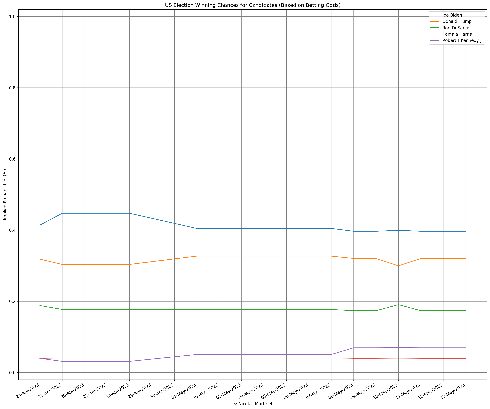
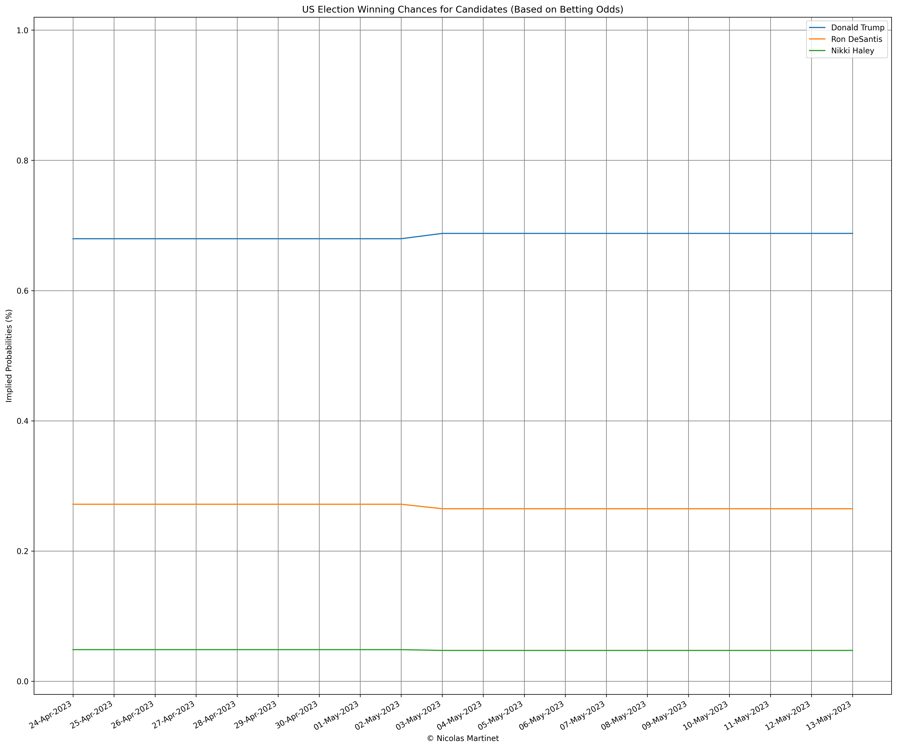
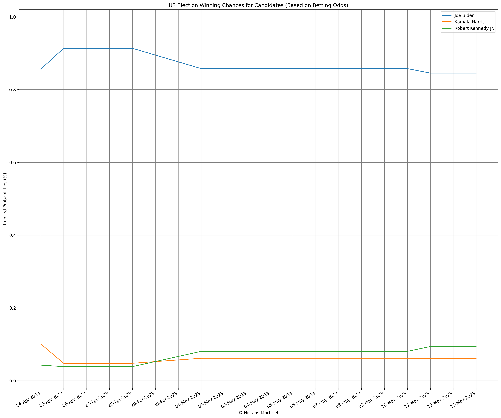

# Election Winning Chances Visualization

This project analyzes and visualizes the winning chances of political candidates in an election based on betting odds data. The data is provided in CSV files, with each file representing a specific date. The project is implemented in Python, using Flask for the web application and D3.js for the visualization.

## Election Winner

## Republican Nominee

## Democrat Nominee

## Features

- Calculates normalized winning probabilities for selected candidates.
- Generates an interactive line chart to visualize the winning probabilities over time.
